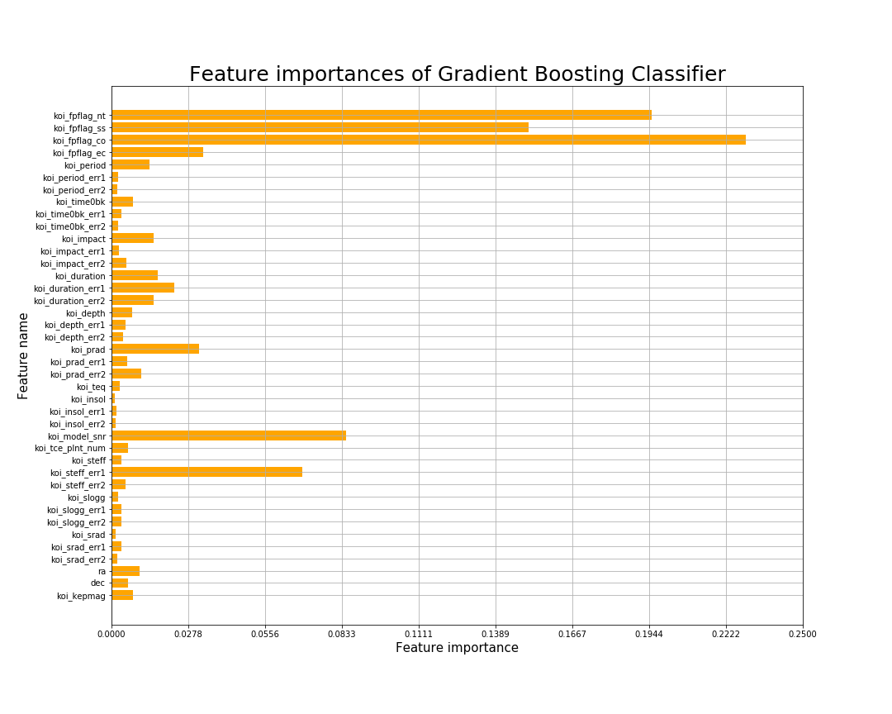

# Machine Learning Challenge

Data column meanings: https://exoplanetarchive.ipac.caltech.edu/docs/API_kepcandidate_columns.html#proj_disp_col

The meaning of the features are shown in the previous link. The category label in the dataset is the 'koi_disposition', which is explained in the link as follows

koi_disposition:

* CANDIDATE: A planetary candidate has passed all prior tests conducted to identify false positives, although this does not a priori mean that all possible tests have been conducted. A future test may confirm this KOI as a false positive.

* FALSE POSITIVE: A false positive has failed at least one of the tests described in Batalha et al. (2012).

* CONFIRMED: Cleary an exoplanet

A planetary candidate has passed all prior tests conducted to identify false positives, although this does not a priori mean that all possible tests have been conducted. A future test may confirm this KOI as a false positive. False positives can occur when: 1) the KOI is in reality an eclipsing binary star, 2) the Kepler light curve is contaminated by a background eclipsing binary, 3) stellar variability is confused for coherent planetary transits, or 4) instrumental artifacts are confused for coherent planetary transits.

## Some tests

I used three different models to try to classify exoplanets:
* Neural Networks
* Random Forests
* Gradient Boosting Classifier

All three models scored higher than 0.85 on the test set, in fact, all were pretty close to 0.9, with the Gradient Boosting Classifier being the one that scored the highest by a little margin.

Both the Random Forest algorithm and the Gradient Boosting Classifier use Decision Trees in their core, but the way they correct the tendency of overfitting of single decision trees is different.

Random Forests create a lot of decison trees taking different random samples from the dataset, and as all of these trees overfit in different ways, the final effect is less overfitting.

Gradient Boosting Classifier instead trains many decision trees in series, while trying to correct the mistakes made by the previous trees.

On the other hand, the neural networks are a little bit harder to interpret, explain and tune. Finding the best number of hidden layers, nodes and the best activation function to use is a challenge when you don't have a lot of experience working with them, even with the help of GridSearch. An even when the model turns out to be good, explaining the decisons made by the network might prove to be difficult.

In an effort to try to make the final model as easy as possible, the best performing of the tree-based models was chosen.

## Final model

The Gradient Boosting Classifier was the chosen final model.

With the help of GridSearch it was possible to fine-tune three of the parameters of the classifier:
* learning_rate: How strong will each new tree try to correct the mistakes made by the previous tree.
* n_estimators: How many trees will the algorithm create. 
* max_depth: The maximum allowed depth of a single tree.

The higher any of this numbers are, the most likely the algorithm will overfit, so a careful selection of them is important.
The final parameters used were:
* learning_rate = 0.05
* n_estimators = 150
* max_depth = 4

In the following graph, the most important features are shown. For the final model, the low scoring features were discarded. It can be clearly seen that the most significant features in deciding the category of a sample of posible exoplanet are: koi_fpflag_nt, koi_fpflag_ss and koi_fpflag_co.

In the final model an accuracy of 0.908 on the test set was achieved. The model does a decent job in classifying new samples of possible exoplanets, but there's still almost 9% that the prediction might be wrong.

As a hobby the model could be used to classify new planets, but in a more strict scientific scenario, improving the model further would be necessary to achieve a higher level of certainty.

To further analyze the results one can use the decision_function or the predict_proba methods of scikit-learn, in order to get the probabilities that the predictions are actually correct.

To improve the model searching for more combinations of parameters could help, but lack of processing power and time limit the possibility of doing that at the moment.
